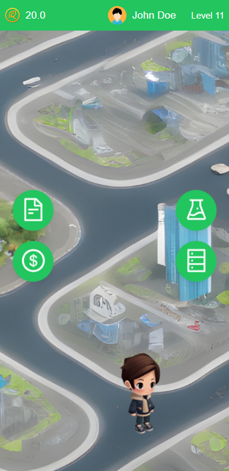

  

<h1 align="center">ReLeaf</h1>

## 📝 Table of Contents

- [Project Name](#project_name)
- [Tagline](#tagline)
- [The Problem it Solves](#problem)
- [Screenshots of our app design](#screenshot)
- [Technologies We Used](#tech)
- [Cover Image](cover_img)

## 🧠Project Name 

Our project name is called ReLeaf.

## 💡 Tagline 

Relief the Earth.

## ⛓️ The Problem it Solves 

### Promoting Sustainable Consumer Behavior
**Problem**: Consumers often lack incentives to make environmentally friendly choices.
**Solution**: By rewarding purchases from sustainable merchants with LeafCoins, the project encourages more people to choose eco-friendly options.

### Enhancing Environmental Awareness and Engagement
**Problem**: Many people are unaware of their environmental impact or lack motivation to participate in green initiatives. 
**Solution**: The AR-driven virtual world and green missions provide interactive and engaging ways to educate users about sustainability and encourage their participation.

### Fostering Virtual Community and Economy
**Problem**: There is a need for new, innovative ways to build and engage virtual communities that have real-world value. 
**Solution**: Collaborating with Meta to create a virtual society with assets purchasable via LeafCoin creates a dynamic, value-driven virtual economy.

### Supporting Sustainable Merchants
**Problem**: Sustainable merchants often struggle to attract customers due to lack of visibility and incentives. 
**Solution**: The project highlights and supports these merchants by integrating them into a reward system, thus driving more customers to their businesses.

## 🚀 Screenshots of our app design 

  
  
  
  

## 🏁 Technologies We Used 

ReactJS, TailwindCSS, HTML, CSS, JavaScript

## 🉠Acknowledgments 
- Superteam Organizing Committee
